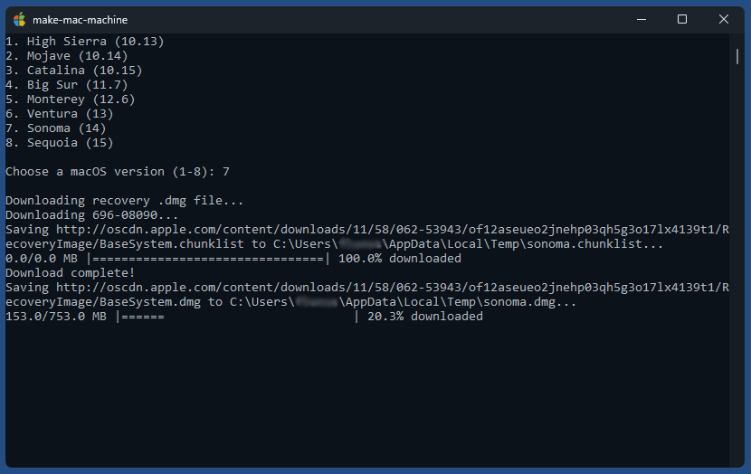
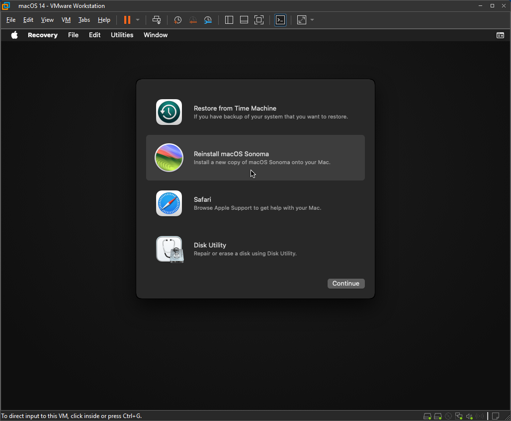

# make-mac-machine

A small tool that allows to quickly create virtual macOS machines for VMWare Workstation Pro without requiring macOS installation media

## Available macOS versions

1. macOS 10.14 (Mojave)
2. macOS 10.15 (Catalina)
3. macOS 11 (Big Sur)
4. macOS 12 (Monterey)
5. macOS 13 (Ventura)
6. macOS 14 (Sonoma)
7. macOS 15 (Sequoia)

## Description

`make-mac-machine.exe` allows to create virtual macOS machines for VMWare Workstation 17.5 or later by using recovery images provided online by Apple. It's based on the [Python code](https://github.com/kholia/OSX-KVM/blob/master/fetch-macOS-v2.py) of repository [OSX-KVM](https://github.com/kholia/OSX-KVM/tree/master). You might want to check out section [Is This Legal?](https://github.com/kholia/OSX-KVM?tab=readme-ov-file#is-this-legal) in their [README](https://github.com/kholia/OSX-KVM/blob/master/README.md).
It also uses [dmg2img](http://vu1tur.eu.org/dmg2img) by Peter Wu and [QEMU](https://www.qemu.org/)'s disk image utility [qemu-img](https://qemu-project.gitlab.io/qemu/tools/qemu-img.html).

After selecting a macOS version the tool first downloads the corresponding recovery .dmg file (into the TEMP directory), then converts it to an .img file using included `dmg2img.exe`, and then finally to a VMWare disk image file (.vmdk) using included `qemu-img.exe`. The new virtual machine can then boot from this recovery disk image and macOS can be installed on the provided empty put prepartioned/preformatted main disk file `disk.vmdk` (Mac OS Extended (Journaled), 40 GB). File `disk.vmdk` is only provided for convenience, so you can immediately start the macOS installation with "Reinstall macOS" without the need to first open Disk Utility and partition/format a disk.

## Prerequisites

- Windows 10/11
- [VMWare Workstation Pro 17.5](https://support.broadcom.com/group/ecx/productdownloads?subfamily=VMware+Workstation+Pro) or later (now [free](https://blogs.vmware.com/workstation/2024/05/vmware-workstation-pro-now-available-free-for-personal-use.html) as in beer)
- macOS support in Workstation unlocked with DrDonk's [unlocker](https://github.com/DrDonk/unlocker/)  
  (Download [unlocker427.zip](https://github.com/DrDonk/unlocker/releases/tag/v4.2.7), unzip, go to subdir "windows" and run "unlock.exe")
- Internet connection
- Current directory must be writable

## Usage

- Run make-mac-machine.exe, select a macOS version and wait until the tool completed
- There should now be new virtual machine in a new folder `macOS-<version>` in the current directory
- Open the .vmx file in this folder in Workstation (if the tool failed to open it automatically) and start the machine
- Install macOS by clicking on "Reinstall macOS"
- Done.

After macOS was successfully installed, power off the machine, go to its settings and remove the installation disk "Hard Disk 2 (SATA)". You can also delete the file `recovery-<version>.vmdk` in the machine's folder since its not needed anymore.

## Screenshots

